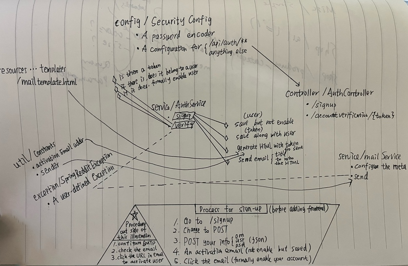
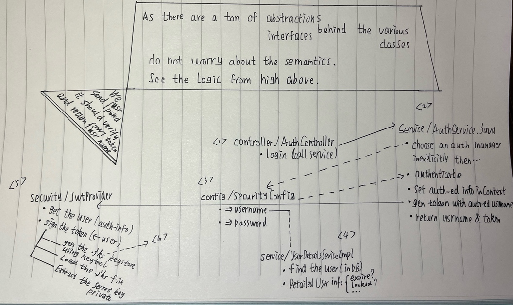
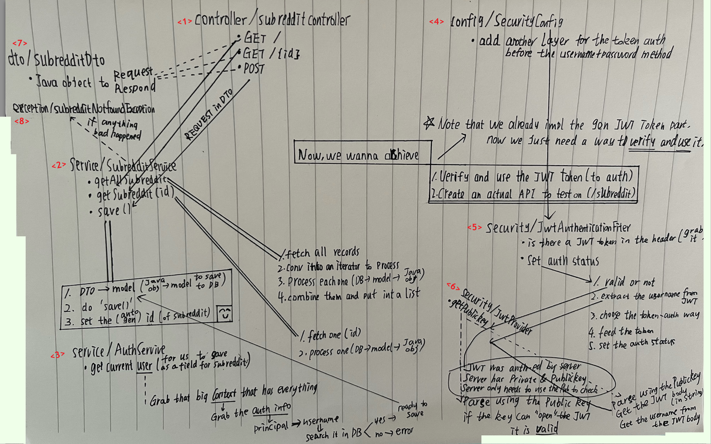
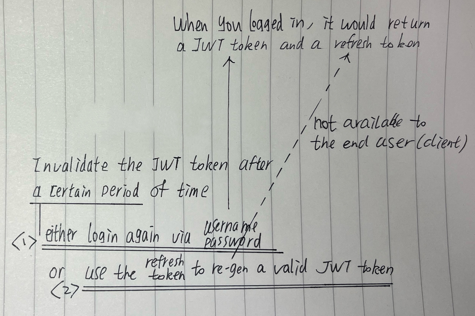

## Backend

### Foundation

1. Installation
    - Spring Suite (e.g. *Security*, *JPA*, *Web*)
    - Database (e.g. *MySQL Connector*)
    - Auth (e.g. *JSON Web Token*)
    - Dev (e.g. *Lombok*)
    - ..

2. Configuration
    - For account registration, we need a fake *SMTP server*
    - For saving data, we need the database related config

### Preparation

1. *Models*: database *table definition* (with a bit of *validation*)
2. *Repositories*: CRUD functionality based on DB for developers

### Feat :: Account Registration

> A simplified illustration of the process and connection between them
>
> 

### Feat :: Account Login

#### Verify and Return Username with JWT Token

- The *KeyStore* security certificate

  - Generate

    ```bash
    security_cerf_alias="springreddit"
    security_cerf_passwd="password"

    keytool -genkeypair -storetype JKS \
        -keyalg RSA -keysize 4096 \
        -validity 3650 \
        -alias $security_cerf_alias \
        -keystore $security_cerf_alias.jks \
        -storepass $security_cerf_passwd
    ```

  - Move the generated `.jks` file into your `resources/` folder

- A simplified illustration of the process and connection between them

    

#### Use the JWT Token and Actually Verify

> A simplified illustration of the process and connection between them
>> Also with the actual `Subreddit` controller implemented for testing purposes
>
> 

#### Invalidate the JWT Token after a Certain Length of Time

> A simplified illustration of the process and connection between them
>
> 

## Frontend

### Foundation

1. Installation: `npm install -g @angular/cli@9.1.0`
2. Initalization

    ```bash
    ng new reddit-frontend

    cd reddit-frontend
    ng serve
    ```
